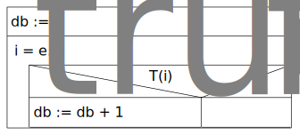
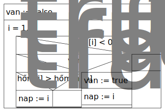
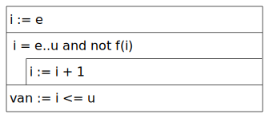
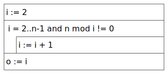
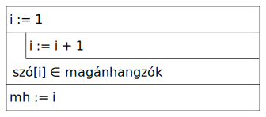

# Programozási minták

1. Összegzés
2. Megszámlálás
3. Maximum kiválasztás
4. Feltételes maximumkeresés
5. Keresés
6. Eldöntés
7. Kiválasztás

## 2. Megszámlálás

**Specifikáció:**

```py
Be: e∈Z, u∈Z 
Ki: db∈N
Ef: - 
Uf: db=DARAB(i=e..u, T(i)) 
```

**Stuktogram:**

```sql
db := 0
FOR: i = e..u
  IF: T(i)
    db := db + 1
  ENDIF:
ENDFOR:
```



## 4. Feltételes maximumkeresés

### Feladatok

1. Egy ember havi bevételeiből és kiadásaiból álló listát kapunk. Határozzuk meg, hogy melyik hónapban volt a legnagyobb a veszteség
2. Adjuk meg n napi statisztika alapján a legmelegebb napot
3. Egy hibakereső szoftverben számokkal jelezzük a hibák súlyosságát. Adjuk meg a legnagyobb súlyú hibát

Ezekben mi a közös?

- Minden esetben egy listát kapunk
- Minden esetben egy listaelemet kell visszaadnunk
- Minden esetben meg kell nézni hogy egyáltalán van-e olyan elem a listában amit visszaadhatunk

<details open>
<summary><b>2. példa - Legmelegebb nap</b></summary>

Határozd meg n napi statisztika alapján a legmelegebb napot

**Specifikáció**

```py
Be: n ∈ N, hőm ∈ [1..n]
Ki: van ∈ L, nap ∈ N
Ef: ∀i ∈ [1..n]: (-100 <= hőm[i] <= 100)
Uf: van = ∃i ∈ [1..n]: hőm[i] < 0 and
    van -> (nap ∈ [1..n] and hőm[nap] < 0 and
            ∀i ∈ [1..n]: hőm[i] < 0 -> hőm[nap] >= hőm[i])
```

**Stuktogram**

```sql
van := false
FOR: i = 1..n
  IF: hőm[i] < 0
    IF: van
      IF: hőm[i] > hőm[nap]
        nap := i
      ENDIF:
    ELSE:
      van := true
      nap := i
    ENDIF:
  ENDIF:
ENDFOR:
```


</details>

### Általánosítás

**Specifikáció**

```py
Be: e ∈ Z, u ∈ Z
Ki: van ∈ L, maxind ∈ Z, maxért ∈ H
Ef: -
Uf: (van, maxind, maxért) = max(i ∈ [e..u]: f(i), T(i))
```

**Stuktogram**

```sql
van := false
maxind := 0
maxért := 0

FOR: i = e..u
  IF: f(i) > maxért
    van := true
    maxind := i
    maxért := f(i)
  ENDIF:
ENDFOR:
```

<details open>
<summary><b>3. példa - Súlyos hiba</b></summary>

Egy hibakereső szoftverben számokkal jelezzük a hibák súlyosságát. Adjuk meg a legnagyobb súlyú hibát

**Specifikáció**

```py
Be: n ∈ N, hibák ∈ Hiba[1..n],
    Hiba = Név x Súly, Név = S, Súly = N
Ki: van ∈ L, lsh ∈ S
Ef: ∀i ∈ [1..n]: (1 <= hibák[i].súly <= 5)
Uf: (van, maxind, maxért) = max(i ∈ [1..n]: hibák[i].súly, true) and
    van -> lsh = hibák[maxind].név
```

**Stuktogram**

```sql
van := false
maxind := 0
maxért := 0

FOR: i = 1..n
  IF: hibák[i].súly > maxért
    van := true
    maxind := i
    maxért := hibák[i].súly
  ENDIF:
ENDFOR:

IF: van
  lsh := hibák[maxind].név
ENDIF:
```


## 5. Keresés

### Feladatok

1. Egy ember havi bevételeiből és kiadásaiból álló listát kapunk. Határozzuk meg, hogy melyik hónapban nem volt veszteség
2. Határozzuk meg egy szám 1-től és önmagától különböző legkisebb osztóját

<details open>
<summary><b>2. példa - Legkisebb osztó</b></summary>

Határozzuk meg egy szám 1-től és önmagától különböző legkisebb osztóját

**Specifikáció**

```py
Be: n ∈ N
Ki: van ∈ L, o ∈ N
Ef: n > 1
Uf: van = ∃i ∈ [2..n-1]: n mod i = 0 and
    van -> (2 <= o < n and n mod o = 0 and
            ∀i ∈ [2..0-1]: n mod i != 0)
```

**Stuktogram**

```sql
i := 2
FOR: i = 2..n-1 and n mod i != 0
  i := i + 1
ENDFOR:
van := i < n
IF: van
  o := i
ENDIF:
```


</details>

### Általánosítás

**Specifikáció**

```py
Be: e ∈ Z, u ∈ Z
Ki: van ∈ L, ind ∈ Z
Ef: -
Uf: van = ∃i ∈ [e..u]: f(i) and
    van -> (e <= ind <= u and f(ind) and
            ∀i ∈ [e..u]: f(i) -> not f(ind))

# Rövidítve
Uf: (van, ind) = keres(i ∈ [e..u]: f(i)) 
```

**Stuktogram**

```sql
i := e
FOR: i = e..u and not f(i)
  i := i + 1
ENDFOR:
van := i <= u
IF: van
  ind := i
ENDIF:
```


## 6. Eldöntés

### Feladatok

1. Egy szóról mondjuk meg hogy egy hónapnak a neve-e
2. Adott egy hallgató jegyeinek listája. Döntsük el, hogy bukott-e meg

<details open>
<summary><b>1. példa - Hónap neve</b></summary>

Egy szóról mondjuk meg hogy egy hónapnak a neve-e

**Specifikáció**

```py
Be: név ∈ S, hónapok_nevei ∈ S[1..12] = {"január", "február", "március", "április", "május", "június", "július", "augusztus", "szeptember", "október", "november", "december"}
Ki: hónapnéve ∈ L
Ef: -
Uf: hónapnéve = ∃i ∈ [1..12]: név = hónapok_nevei[i]
```

**Stuktogram**

```sql
i := 1
FOR: i = 1..12 and név != hónapok_nevei[i]
  i := i + 1
ENDFOR:
hónapnéve := i <= 12
```


</details>

### Általánosítás

**Specifikáció**

```py
Be: e ∈ Z, u ∈ Z
Ki: van ∈ L
Ef: -
Uf: van = ∃i ∈ [e..u]: f(i)
```

**Stuktogram**

```sql
i := e
FOR: i = e..u and not f(i)
  i := i + 1
ENDFOR:
van := i <= u
```



## 7. Kiválasztás

### Feladatok

1. Egy ember havi bevételeiből és kiadásaiból álló listát kapunk. Év végére nőtt a vagyona. Adjunk meg egy hónapot, amikor nőtt a vagyona
2. Adjunk meg egy 1-nél nagyobb természetes szám legkisebb osztóját (!=1)
3. Adjunk meg egy magyar szó egy magánhangzóját

<details open>
<summary><b>2. példa - Legkisebb osztó</b></summary>

Adjunk meg egy 1-nél nagyobb természetes szám legkisebb osztóját (!=1)

**Specifikáció**

```py
Be: n ∈ N
Ki: o ∈ N
Ef: n > 1
Uf: o = min(i ∈ [2..n-1]: n mod i = 0)
```

**Stuktogram**

```sql
i := 2
FOR: i = 2..n-1 and n mod i != 0
  i := i + 1
ENDFOR:
o := i
```



</details>

### Általánosítás

**Specifikáció**

```py
Be: e ∈ Z
Ki: ind ∈ Z
Ef: ∀i ∈ [e..inf): f(i)
Uf: ind >= e and f(ind) and
    ∀i ∈ [e..ind-1]: not f(i)

# Rövidítve
Uf: ind = kiválaszt(i ∈ [e..inf): f(i))
```

**Stuktogram**

```sql
i := e
LOOP:
  i := i + 1
ENDLOOP: f(i)
ind := i
```


<details open>
<summary><b>3. példa - Magánhangzó</b></summary>

Adjunk meg egy magyar szó egy magánhangzóját

**Specifikáció**

```py
Be: szó ∈ S
Ki: mh ∈ N
Fv: magánhangzók:K -> L
    magánhangzók = {"a", ... }
Ef: -
Uf: mh = kiválaszt(i ∈ [1..|szó|]: szó[i] ∈ magánhangzók)
```

**Stuktogram**

```sql
i := 1
LOOP:
  i := i + 1
ENDLOOP: szó[i] ∈ magánhangzók
mh := i
```



</details>

## 1. Összegzés

### Feladatok

1. Egy számsorozat tagjainak adjuk meg az abszolút értékét

<details open>
<summary><b>1. példa - Abszolút érték</b></summary>

Egy számsorozat tagjainak adjuk meg az abszolút értékét

**Specifikáció**

```py
Be: n ∈ N, x ∈ Z[1..n]
Ki: y ∈ Z[1..n]
Ef: -
Uf: ∀i ∈ [1..n]: y[i] = |x[i]|
```

**Stuktogram**

```sql
FOR: i = 1..n
  y[i] := |x[i]|
ENDFOR:
```


### Általánosítás

**Specifikáció**

```py
Be: e ∈ Z, u ∈ Z
Ki: y ∈ Z[1..u-e+1]
Ef: -
Uf: ∀i ∈ [e..u]: y[i-e+1] = f(i)


# Rövidítve
Uf: y = másol(i ∈ [e..u]: f(i))
```

**Stuktogram**

```sql
FOR: i = e..u
  y[i-e+1] := f(i)
ENDFOR:
```


