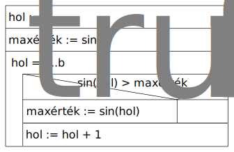

# Feladatmegoldási minta

## 1. Gyorsabb vonat az előzőnél

Ismerjük N vonat mentrendjét Budapest-Siófok

Írj egy programot amely megadja, hogy melyik vonat gyorsabb mint az előző.

**Minta:**

`KERESÉS`

**Specifikáció:**

```py
Be: N ∈ N, midő ∈ N[1..n]
Ki: van ∈ L, melyik ∈ N
Ef: -
Uf: (van, melyik) = KERES(i=2..n, midő(i) < midő(i-1))
```

**Stuktogram:**

```sql
melyik := 2
FOR: melyik = 2..n and midő(melyik) >= midő(melyik-1)
  melyik := melyik + 1
ENDFOR:
van := melyik <= n
```


**Code:**

```cs
// Deklaráció
int n;
int[] mido;
bool van;
int melyik;

// Beolvasás
Console.Write("N = ");
n = int.Parse(Console.ReadLine());
mido = new int[n];

for (int i = 0; i < n; i++)
{
    Console.Write($"midő({i}) = ");
    mido[i] = int.Parse(Console.ReadLine());
}

// Feldolgozás
melyik = 2;
while (melyik <= n && mido[melyik - 1] >= mido[melyik - 2])
{
    melyik++;
}

van = melyik <= n;

// Kiírás
Console.WriteLine($"van = {van}");
if (van)
{
    Console.WriteLine($"melyik = {melyik}");
}
else
{
    Console.WriteLine("nincs");
}
```

## 2. Sin

Írj egy programot amely megadja, hogy a és b között hol veszi fel a legnagyobb értéket a sin függvény.

**Minta:**

`KERESÉS`

<u>Sa:</u> Segéd adatok

**Specifikáció:**

```py
Be: a, b ∈ Z
Ki: hol ∈ Z
Sa: maxérték ∈ R
Ef: -
Uf: (hol, maxérték) = KERES(i=a..b, sin(i) > maxérték)
```

**Stuktogram:**

```sql
hol := a
maxérték := sin(a)
FOR: hol = a..b
  IF: sin(hol) > maxérték
    maxérték := sin(hol)
  ENDIF:
  hol := hol + 1
ENDFOR:
```



## 3. Valódi osztók száma

Adjuk meg egy természetes szám valódi osztóinak számát!

**Minta:**

`KERESÉS`

Itt most nem segédváltozókat, hanem constansokat használunk.
Ezeket a Bemenetnél megadjuk majd az Előfeltételben értéket adunk nekik.

**Specifikáció:**

```py
Be: n ∈ N, e ∈ N
Ki: db ∈ N
Ef: e = 2
Uf: db = SZUM(i=1..n div 2, n mod i = 0)
```

**Stuktogram:**

```sql
db := 0
FOR: i = 1..n div 2
  IF: n mod i = 0
    db := db + 1
  ENDIF:
ENDFOR:
```


## Függvények

### 1. Szám négyzete

Adjuk meg egy szám négyzetét!

**Specifikáció:**

```py
Be: x ∈ R
Ki: y ∈ R
Fv: négyzet: R -> R, négyzet(x) = x * x
Ef: -
# Uf: y = x * x
Uf: y = négyzet(x)
```

**Stuktogram:**

```sql
-- y := x * x

négyzet(n: R): R
négyzet := n * n

y := négyzet(x)
```

**Code:**

```cs
static double Négyzet(double n)
{
    return n * n;
}

double x, y;

Console.Write("x = ");
x = double.Parse(Console.ReadLine());

y = Négyzet(x);

Console.WriteLine($"y = {y}");
```

```rs
use text_io::read;

fn négyzet(n: f64) -> f64 {
    n * n
}

fn main() {
    let x: f64;
    let y: f64;

    print!("x = ");
    x = read!();

    y = négyzet(x);

    println!("y = {y}");
}
```

### 2. Maximum

Adjuk meg két szám közül a nagyobbat!

**Specifikáció:**

```py
Be: a, b ∈ Z
Ki: m ∈ Z
Fv: max: Z x Z -> Z, max(a, b) = {a, ha a >= b;
                                  b egyébként}
Ef: -
Uf: m = max(a, b)
```

**Stuktogram:**

```sql
max(a: Z, b: Z): Z
IF: a >= b
  max := a
ELSE:
  max := b

m := max(a, b)
```

**Code:**

```cs
static int Max(int a, int b)
{
    return a >= b ? a : b;
}

int a, b, m;

Console.Write("a = ");
a = int.Parse(Console.ReadLine());

Console.Write("b = ");
b = int.Parse(Console.ReadLine());

m = Max(a, b);

Console.WriteLine($"m = {m}");
```

```rs
use text_io::read;

fn max(a: i32, b: i32) -> i32 {
    if a >= b {
        a
    } else {
        b
    }
}

fn main() {
    let a: i32;
    let b: i32;
    let m: i32;

    print!("a = ");
    a = read!();

    print!("b = ");
    b = read!();

    m = max(a, b);

    println!("m = {m}");
}
```

### 3. Növelés

Növeljünk egy számot egy másikkal!

**Specifikáció:**

```py
Be: a, b ∈ Z
Ki: c ∈ Z
Fv: növel: Z x Z -> Z, növel(a, b) = a + b
Ef: -
Uf: c = növel(a, b)
```

**Stuktogram:**

```sql
növel(a: Z, b: Z): Z
növel := a + b

c := növel(a, b)
```

**Code:**

```cs
static int Növel(ref int a, int b)
{
    return a += b;
}

int a, b, c;

Console.Write("a = ");
a = int.Parse(Console.ReadLine());

Console.Write("b = ");
b = int.Parse(Console.ReadLine());

c = Növel(ref a, b);

Console.WriteLine($"c = {c}");
```

```rs
use text_io::read;

fn növel(a: &mut i32, b: i32) -> i32 {
    *a += b;
    *a
}

fn main() {
    let mut a: i32;
    let b: i32;
    let c: i32;

    print!("a = ");
    a = read!();

    print!("b = ");
    b = read!();

    c = növel(&mut a, b);

    println!("c = {c}");
}
```
