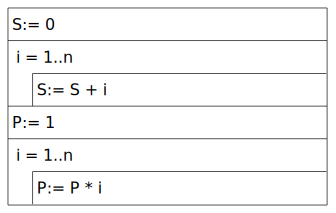
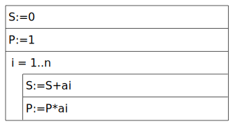

# Több programozási tétel egybefűzése

## Maximum kiválasztás + Kiválogatás

<details open>
<summary><b>1. Összes maximum</b></summary>

Adott számok sorozata. Adjuk meg a maximumot (az összeset)

**Specifikáció:**

```py
Be: n ∈ N, a ∈ Z[1..n]
Ki: max ∈ Z
Fv: max: Z^n -> Z, max(a1, a2, ..., an) = max{a1, a2, ..., an}
```

**Stuktogram:**

```sql
max := a1
i := 2
LOOP:
    IF: max < ai
        max := ai
    ENDIF:
    i := i + 1
ENDLOOP: i <= n
```


</details>

<details open>
<summary><b>2. Legmesszebb lévő pont</b></summary>

Melyik az origótól legmesszebb lévő pont?

**Specifikáció:**

```py
Be: n ∈ N, p ∈ Pont[1..n],
    Pont = {x, y ∈ R}
Ki: max ∈ Pont
Fv: max: Pont^n -> Pont, max(p1, p2, ..., pn) = max{p1, p2, ..., pn}
```

**Stuktogram:**

```sql
max := p1
maxérték := p1x^2 + p1y^2
i := 2

LOOP:
    táv := pix^2 + piy^2
    IF: max < táv
        max := i
        maxérték := táv
    ENDIF:
    i := i + 1
ENDLOOP: i <= n
```


## Függvénykompozíció

### Függvények egybeágyazása

```sql
Be:= g(A); C:= f(B)
Ki:= h(C)
```

### Ciklusok összevonása

Azonos lépésszámú ciklusok összevonása

```sql
S:= 0
FOR: i = 1..n
    S:= S + i
ENDFOR:

P:= 1
FOR: i = 1..n
    P:= P * i
ENDFOR:
```



```sql
S:=0
P:=1
FOR: i = 1..n
    S:=S+ai
    P:=P*ai
ENDFOR:
```


