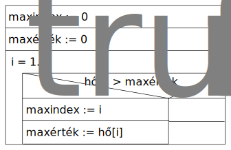

# 3. elmélet

## Mátrix

- Azonos funkciójú elemek kétirányú sorozata
- n-irányú (n dimenziós) sorozat: Tensor

### Specifikáció

```py
sakktábla ∈ [8, 8]
```

## Analóg programozás

Ha van egy feladat, amelyhez már korábban egy hasonló feladatot megoldottunk,
akkor a feladatok közötti hasonlóságokat kihasználva megoldhatjuk az új feladatot is.

**Visszavezetés módszere**

- A feladatot egy korábban megoldott feladatra vezetjük vissza.

<details open>
<summary><b>1. példa - Elemek összege</b></summary>

Határozd meg egy n elemű tömb elemeinek összegét

**Specifikáció**

```py
Be: n ∈ N, kg ∈ [1..n]
Ki: össz ∈ N
Ef: -
Uf: össz = ∑i ∈ [1..n]: kg
```

**Stuktogram**

```sql
össz := 0

FOR: i = 1..n
  össz := össz + kg[i]
ENDFOR:
```


</details>

<details open>
<summary><b>2. példa - Skaláris szorzat</b></summary>

Határozd meg két n elemű tömb skaláris szorzatát

**Specifikáció**

```py
Be: n ∈ N, a ∈ Z[1..n], b ∈ Z[1..n]
Ki: s ∈ Z
Ef: -
Uf: s = ∑i ∈ [1..n]: a[i] * b[i]
```

**Stuktogram**

```sql
s := 0

FOR: i = 1..n
  s := s + a[i] * b[i]
ENDFOR:
```


</details>

<details open>
<summary><b>3. példa - Számok összege</b></summary>

Határozd meg az a és b egész számok (a <= b) közötti számok összegét (határokat is beleértve)

**Specifikáció**

```py
Be: a ∈ Z, b ∈ Z
Ki: össz ∈ Z
Ef: a <= b
Uf: össz = ∑i ∈ [a..b]: i
```

**Stuktogram**

```sql
össz := 0

FOR: i = a..b
  össz := össz + i
ENDFOR:
```


</details>

<details open>
<summary><b>4. példa - Maximum kiválasztás</b></summary>

Határozd meg n napi statisztika alapján a legmelegebb napot

**Specifikáció**

```py
Be: n ∈ N, hő ∈ [1..n]
Ki: nap ∈ N
Ef: -
Uf: (maxindex, maxérték) = max(i ∈ [1..n]: hő[i])
    nap = maxindex
```

**Stuktogram**

```sql
maxindex := 0
maxérték := 0

FOR: i = 1..n
  IF: hő[i] > maxérték
    maxindex := i
    maxérték := hő[i]
  ENDIF:
ENDFOR:
```

